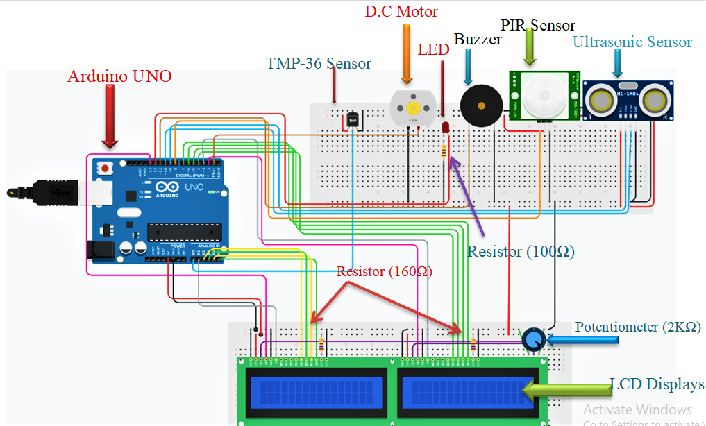
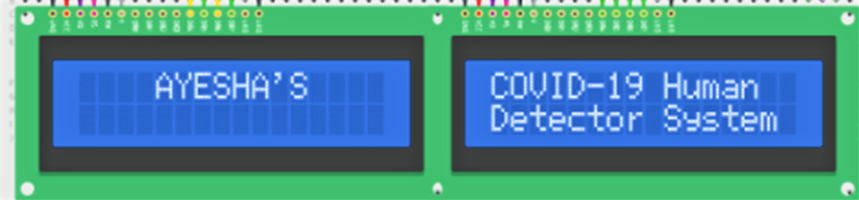
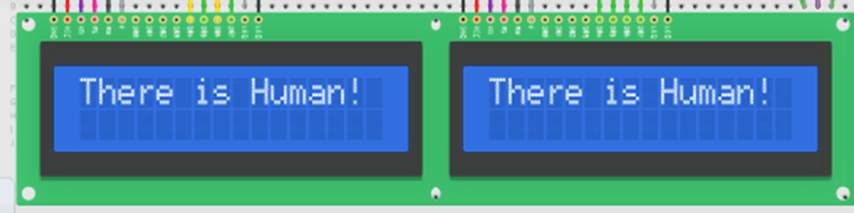
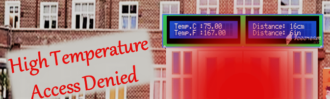
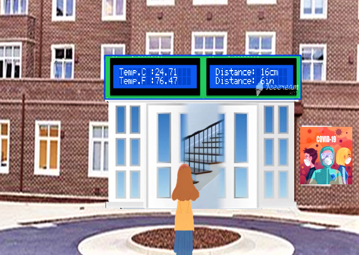

# Covid-19-Human-Detection-System-using-Sensors
## Table of Content
 1. Problem Statement
 2. Proposed Soultion
 3. Hardware used
 4. Software Technologies-used
 8. Block Diagram
 9. Circuit Diagram
 10. Workflow
 11. Result and Discussion 
 12. Scope
  
### Problem Statement
At this time of the pandemic, all the offices are closed because of Coronavirus.As the pandemic slowly settles and such sectors become eager to resume in-person work, individuals are still skeptical of getting back to the office.Despite the vaccine, the second wave of the virus has came and affect almost all countries imposed lockdown. So in such circumstances, temperature checking and use of contact less hand opners is an effective way to tackle the deadly corona virus.Multiple studies have shown that the use of touchless opener & temperature checking reduces the risk of viral transmission as well as provides a sense of protection. However, it is infeasible to manually enforce such a policy on large premises and track any violations.Covid-19-Human-Detection-Systems provides a better alternative. Using a combination of micro-controller, motor and sensor we developed a robust system that can help people hundred percent contact free.

### Proposed Solution
Many Organizations are making it compulsory to follow social distancing and temperature detection.This project cost-effective Arduino-based system aiming to help organizations respect the COVID-19 safety rules and guidelines in order to reduce the disease spread is presented. 
It can be quite helpful to the offices at this time as it can be installed outside the office and will help to sense the temperature of every person who is coming to the office and by allowing automatic entry to right person.

### Hardware Used
- Arduino UNO
- Ultrasonic Sensor
- PIR Sensor
- Temperature Sensor
- LCD Displays
- Breadboard
- DC Motor
- Buzzer 
- 12V Adapter

### Software Technologies Used
- Arduino IDE
- TinkerCAD
- VS code studio

### Circuit Diagram

### Outcome of the Project
- First when system start, it display AYESHA’S COVID-19 Human Detector System as shown

- Now main processing of our project starts from here, PIR sensor or IR motion sensor there is a PIR sensor that will perceive the individual approaching via sense whether a human has moved in or out of the sensors range. If it sense then LCD display “There is human!”

During this covid-19 pandemic, high temperature may be sign of covid. So here we set a condition i.e. if temperature of human being exceeds average human body temperature (37 °C), then Arduino Uno generates signal to stay close the door in order to prevent the person from entering the building as shown in below Figure and for warning buzzer beeps, Led turned on to make sure that person does not try to enter the building further

Otherwise, if passenger’s temperature is detected normal i.e. less than or equal to 37.5℃, then arduino will send signal to open the door via motor as shown in Figure , DC motor rotates with 5555 rpm.

### Features
- One of the most commonly used choices is to use automatic door temperature detection system to meet this challenge. In this case, you do not need to hire extra staffs for temperature detection system regularly.
- Another important feature of this COVID-19 Human Detector System is no one can enter without go through this temperature checking process.
- Now a days open door via palm touch can also become a factor to spread COVID-19, so people opening the door with the elbow for protection infection COVID-19. This is a great benifit of this project that it replaces this problem with automatic touchless door via sensors.
